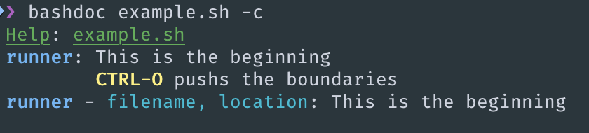

# BashDoc

A tool for generating documentation/help menu for user defined bash functions.

## Syntax

### Example

```bash
#;
# cd()
# moves to given directory
# @param directory: folder to move to
# @return void
#"
cd() {
    cd $1
}
```

Outputs



with lots of color!

### Global Delimiters

`START_DELIM = #;`

`END_DELIM = #"`

`PAR_DELIM = @param`

`RET_DELIM = @return`

`OPT_DELIM = # -`

`COMM_DELIM = #`

These can be modifed in the code to your preference.

## Install

**NOTE: Must be on Rust v1.30**

_update with `rustup update stable`__

```bash
git clone https://github.com/dustinknopoff/bashdoc
cd bashdoc
cargo install
```

## Usage

```
bashdoc 1.0
Creates a "javadoc" like structure for bash. See github repo github.com/dustinknopoff/bashdoc for information on
formatting.

USAGE:
    bashdoc [FLAGS] [OPTIONS] <INPUT>

FLAGS:
    -c, --color        toggles color
    -d, --directory    pass a glob pattern to run on.
    -h, --help         Prints help information
    -V, --version      Prints version information

OPTIONS:
    -j, --json <FILE>    print result as JSON

ARGS:
    <INPUT>    Sets the input file to use

```