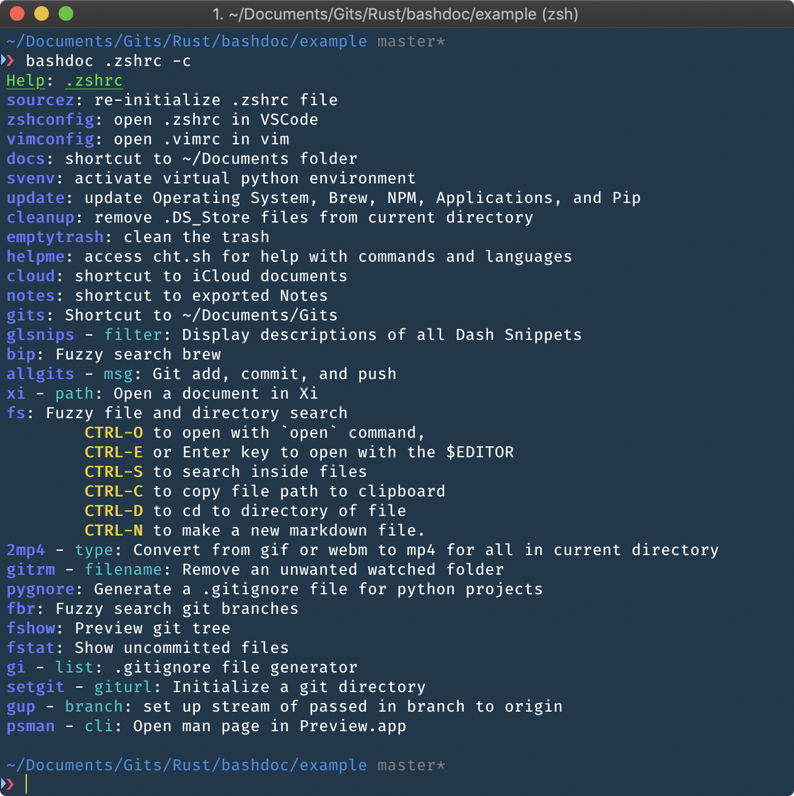

# bashdoc

## BashDoc

A tool for generating documentation/help menu for user defined bash functions.

### Syntax

#### Example

```bash
#;
# cd()
# moves to given directory
# @param directory: folder to move to
# @return void
#"
cd() {
   cd $1
}
```

Outputs



with lots of color!

#### Global Delimiters

`START_DELIM = #;`

`END_DELIM = #"`

`PAR_DELIM = @param`

`RET_DELIM = @return`

`OPT_DELIM = # -`

`COMM_DELIM = #`

These can be modifed in your `.bashdocrc`.

### Install

**NOTE: Must use Rust 2018 Edition**

_update with `rustup update stable`_

```bash
git clone https://github.com/dustinknopoff/bashdoc
cd bashdoc
cargo install
```

### Usage

```bash
bashdoc 1.0
Creates a "javadoc" like structure for bash. See github repo github.com/dustinknopoff/bashdoc for information on
formatting.

USAGE:
   bashdoc [FLAGS] [OPTIONS] <INPUT> [SUBCOMMAND]

FLAGS:
   -c, --color        toggles color
   -d, --directory    pass a glob pattern to run on.
       --help         Prints help information
   -V, --version      Prints version information
   -w, --watch        continuously update on change

OPTIONS:
   -h, --html <html>    output html documentation
   -j, --json <FILE>    print result as JSON

ARGS:
   <INPUT>    Sets the input file to use

SUBCOMMANDS:
   help        Prints this message or the help of the given subcommand(s)
   override    override the delimiters
```

